# 提分神器小程序 — 架构分析报告（第二次验证）

> 生成日期: 2026-06-08
> 上次验证: 2026-06-07
> 分析范围: 全系统（96个云函数目录、29个数据库集合、新增3个业务域）

---

## 文档索引

| 文档 | 说明 |
|------|------|
| [business-architecture.md](./business-architecture.md) | 业务架构：9大业务域、18条业务规则、6条核心流程 |
| [data-architecture.md](./data-architecture.md) | 数据架构：29个集合目录、5个核心数据模型、数据一致性矩阵 |
| [integration-verification.md](./integration-verification.md) | 集成验证：19个问题（3个P0/4个P1/5个P2/3个P3+4新增）+ 修复路线图 |
| [fix-plan.md](./fix-plan.md) | 前次修复方案（部分已执行） |

---

## 系统全景图（更新版）

```mermaid
graph TB
    subgraph 前端小程序
        Home[首页]
        Assessment[测评页]
        Practice[练习页]
        QueueApi[队列轮询]
    end

    subgraph 云函数-业务层
        Login[login]
        StartAssess[startAssessment]
        SubmitAns[submitAnswer]
        GetAssess[getAssessment]
        PracticeV2[practice_v2]
        SubmitResult[submitPracticeResult]
        StudentMem[studentMemory]
        PointsMgr[pointsManager]
        ParentAssess[parentAssessment 🆕]
        StartExam[startExclusiveExam 🆕]
        UploadMat[uploadMaterial 🆕]
        DailyTask[generateDailyTask 🆕]
    end

    subgraph 云函数-后台任务
        QGen[questionGenerator<br/>每分钟]
        SchedGen[scheduledTaskGenerator<br/>每小时]
        GenAI[generateAiQuestion]
    end

    subgraph 数据层
        Users[(users)]
        Assessments[(assessments ⚠️双重存储)]
        QuestionPool[(ai_question_pool)]
        QuestionQueue[(question_queue)]
        StudentMemory[(student_memory)]
        KnowledgePoints[(knowledge_points)]
        ParentAssess[(parent_assessments 🆕)]
        UserExams[(user_exams 🆕)]
        Materials[(materials 🆕)]
    end

    Home --> Login
    Home --> StartAssess
    Assessment --> GetAssess
    Assessment --> SubmitAns
    Practice --> PracticeV2
    QueueApi --> QueueApi

    StartAssess --> QuestionPool
    StartAssess --> QuestionQueue
    StartAssess --> Assessments

    QGen --> QuestionQueue
    QGen --> GenAI
    QGen --> QuestionPool
    QGen --> Assessments

    SchedGen --> QuestionPool

    ParentAssess --> ParentAssess
    StartExam --> UserExams
    UploadMat --> Materials

    style Assessments fill:#ff9999
    style PracticeV1 fill:#ffcc99
```



---

## 关键发现摘要

### 验证结果统计

| 状态 | 前次 | 本次 |
|------|------|------|
| ✅ 已修复 | 0 | 2 |
| 🟡 部分修复 | 0 | 8 |
| 🔴 仍存在/恶化 | 15 | 5 |
| 🆕 新发现 | 0 | 4 |
| **总计** | **15** | **19** |

### 已修复的问题 ✅

| # | 问题 | 修复内容 |
|---|------|---------|
| P0-02 | 两套API层并存 | `api.js` + `cloudApi.js` 已删除，前端改为直接 `callFunction` |
| P2-05 | 队列清理后不重试 | `TARGET_QUEUE_ID` 已移除，`cleanupStuckTasks` 重置为 pending + 重试计数 |

### 🔴 P0 严重问题（3个）

| # | 问题 | 根因 | 影响 |
|---|------|------|------|
| P0-01 | Assessment双重存储(恶化) | 两条路径存储格式不同，消费方只读一条路径 | **队列测评返回0题、无法判分** |
| P0-02 | scheduledTask输出未归一化 | 未使用 normalizeQuestion() | 题池格式混杂 |
| P0-03 | 内联归一化逻辑未统一 | 3处独立内联转换不与normalizer同步 | 修改normalizer时不同步 |

### 🟠 P1 高优先级问题（4个）

| # | 问题 | 根因 |
|---|------|------|
| P1-01 | 代码重复16份(设计约束) | 微信云函数部署机制要求每函数自包含 |
| P1-02 | 5条生成路径3条未用normalizer | 路径1/4/5用内联转换 |
| P1-03 | generateDailyTask冷启动硬编码 | 不论年级都返回8年级"二次根式" |
| P1-04 | response-helper已创建未使用 | 尚无云函数引入 |

### 🟡 P2 中优先级问题（5个）

| # | 问题 |
|---|------|
| P2-01 | student_id = openid 混用 |
| P2-02 | knowledge_points同步需手动触发 |
| P2-03 | 题目去重无写入时保护 |
| P2-04 | practice v1目录残留 |
| P2-05 | 25个废弃/调试云函数积压 |

### 🟢 P3 改善建议（3个）

| # | 问题 |
|---|------|
| P3-01 | LLM Provider管理仍部分分散 |
| P3-02 | 错误处理不统一(response-helper未用) |
| P3-03 | schema_version无消费者 |

---

## 新增功能（前次未覆盖）

| 功能 | 云函数 | 集合 |
|------|--------|------|
| 家长测评 | parentAssessment | parent_assessments |
| 专属考试(VIP) | startExclusiveExam, uploadMaterial | user_exams, materials, user_materials_vectors |
| 社交学习 | createFamily, bindPartner, matchPartner... | - |
| 每日任务 | generateDailyTask, getTodayTasks | - |
| 管理后台 | adminLogin, adminProxy, adminReviewMaterial | admin |
| 数据分析 | analytics | analytics |

---

## 修订后的修复路线图

```
Phase 1: 紧急修复 (1-2天)              Phase 2: 代码整合 (3-5天)
┌───────────────────────────────┐      ┌───────────────────────────────┐
│ P0-01 getAssessment/submitAns │      │ P1-01 部署脚本自动同步shared/  │
│       添加question_ids回退    │      │ P1-02 5条路径统一用normalizer │
│ P0-02 scheduledTask用normalizer│      │ P1-03 冷启动按年级选知识点    │
│ P0-03 内联转换→normalizer     │      │ P1-04 引入response-helper     │
└───────────────────────────────┘      └───────────────────────────────┘
                                                │
                                                ▼
                                       Phase 3: 清理 (2-3天)
                                       ┌───────────────────────────────┐
                                       │ P2-02 syncKP添加定时触发器     │
                                       │ P2-03 SaveQStep写入前checkDup │
                                       │ P2-04 删除practice v1目录     │
                                       │ P2-05 清理25个废弃云函数      │
                                       └───────────────────────────────┘
```

---

## 架构改进目标 vs 进度

| 维度 | 前次现状 | 当前现状 | 目标 |
|------|---------|---------|------|
| 题目格式 | 5种混杂 | 3种混杂(2/5已用normalizer) | 1种统一Schema |
| API层 | 2套并存 | ✅ 1套(callFunction直连) | ✅ 1套 |
| 生成路径 | 5条独立 | 5条(2条已用normalizer) | 1条共享 |
| 代码重复 | llm-core×4, kt×7 | 各16份(部署约束) | 自动同步 |
| LLM Provider | 3种分散 | 2种(shared+独立) | 统一接口 |
| 题目集合 | 2个 | ✅ 1个(ai_question_pool) | ✅ 1个 |
| Practice版本 | v1+v2 | v1重定向到v2 | 仅v2(删除目录) |
| Assessment存储 | 双重 | ⚠️ 双重+消费方不兼容 | 统一 |
| 错误处理 | 不统一 | helper已创建未使用 | 统一 |
