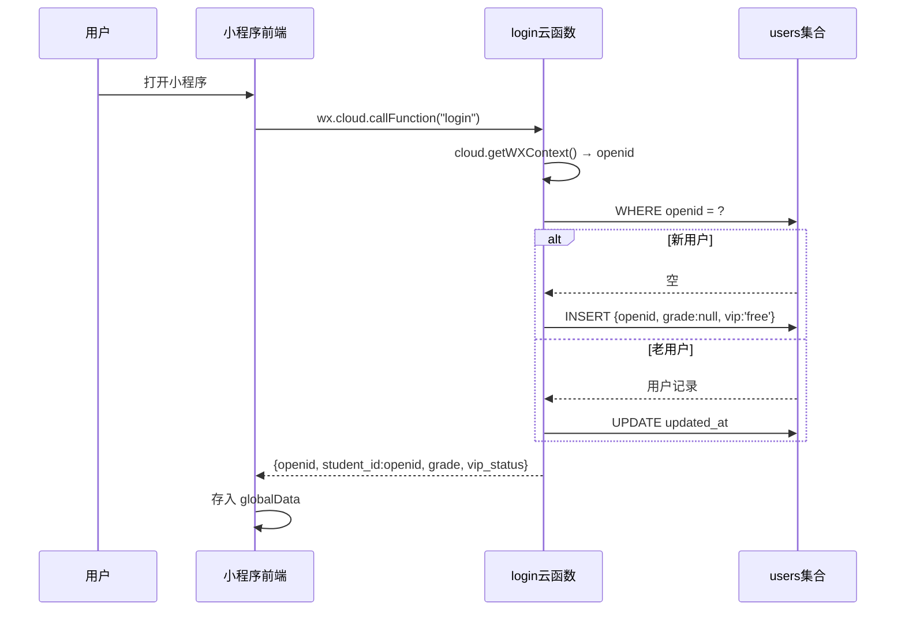
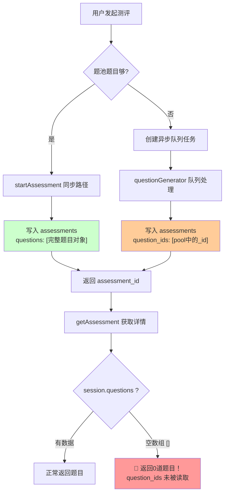
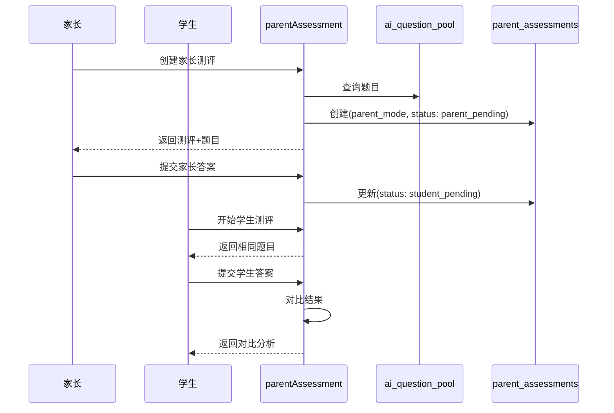
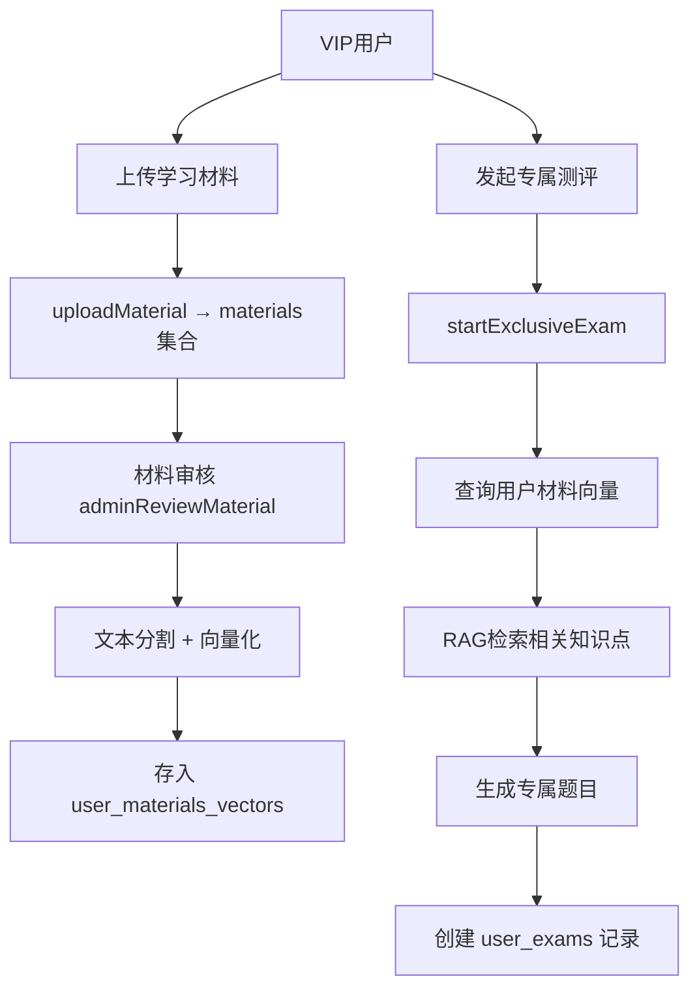
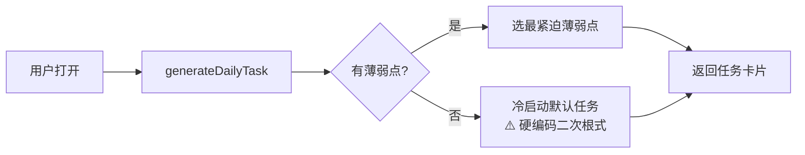
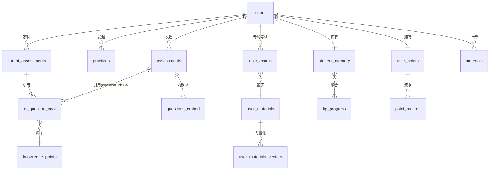

# 业务架构分析（第二次验证）

> 生成日期: 2026-06-08
> 上次分析: 2026-06-07
> 范围: 提分神器小程序全系统（96个云函数目录）

---

## 1. 业务域划分

系统围绕学生个性化学习场景，划分为 **9 个业务域**（前次6个，新增3个）：

| 业务域 | 核心价值 | 关键云函数 | 变更 |
|--------|---------|-----------|------|
| 用户管理 | 注册、登录、资料、VIP | login, getUserInfo, updateUserProfile, checkVipStatus | 无变化 |
| 测评 (Assessment) | 诊断学生水平 | startAssessment, questionGenerator, submitAnswer, getAssessment | ⚠️ 双重存储问题恶化 |
| 练习 (Practice) | 针对性强化训练 | practice_v2, submitPracticeResult | v1已废弃重定向 |
| 学习记忆 | 画像追踪、薄弱点管理 | studentMemory, getKpProgress | 无变化 |
| 积分体系 | 激励机制 | pointsManager, signIn, checkTodaySignIn, getCheckinHistory | 新增签到 |
| 反馈 | 用户声音 | submitFeedback, getFeedbackList, replyFeedback | 无变化 |
| **家长测评** | **家长-学生对比测评** | **parentAssessment** | 🆕 新增 |
| **专属考试** | **VIP上传材料生成专属题目** | **startExclusiveExam, uploadMaterial, adminReviewMaterial** | 🆕 新增 |
| **社交学习** | **家族、伙伴、排行榜、成就** | **createFamily, joinFamily, bindPartner, matchPartner, getRankings, getAchievements** | 🆕 新增 |

---

## 2. 核心业务流程

### 2.1 流程 A：用户注册/登录（无变化）

---

### 2.2 流程 B：测评 (Assessment) — ⚠️ 存储分裂问题

**关键问题**：两条路径的存储格式不同，但 `getAssessment` 和 `submitAnswer` 只处理同步路径的格式。

---

### 2.3 流程 C：练习 (Practice)（无变化）

practice v1 已废弃并重定向到 v2，但目录仍存在。

---

### 2.4 流程 D：学习记忆系统（无变化）

---

### 2.5 🆕 流程 E：家长测评

**业务对象**：`parent_assessments`

---

### 2.6 🆕 流程 F：专属考试 (VIP)

**业务对象**：`user_materials`, `user_materials_vectors`, `user_exams`

**业务规则**：
- 普通用户每月1次专属测评
- VIP用户每月10次

---

### 2.7 🆕 流程 G：每日任务

**问题**：冷启动默认任务硬编码8年级"二次根式"，对低年级用户不友好。

---

### 2.8 后台定时任务

| 任务 | 触发频率 | 处理内容 | 写入集合 | 变更 |
|------|---------|---------|---------|------|
| questionGenerator | 每分钟 | 队列题目生成 | `ai_question_pool`, `assessments` | ✅ TARGET_QUEUE_ID已移除 |
| scheduledTaskGenerator | 每小时 | 批量AI题目 | `ai_question_pool` | ✅ 密钥→环境变量、全年级 |

---

## 3. 业务对象关系图（更新版）

---

## 4. 业务规则汇总（更新至18条）

| 规则ID | 业务域 | 描述 | 实现位置 | 变更 |
|--------|--------|------|---------|------|
| BR-01 | 测评 | 题目不足时走异步生成 | startAssessment | 无变化 |
| BR-02 | 测评 | 复测难度基于上次成绩 | startAssessment | 无变化 |
| BR-03 | 测评 | 科目内容验证: 关键词过滤 | getAssessment, questionGenerator | 无变化 |
| BR-04 | 测评 | 队列优先级: priority DESC | queue-manager | 无变化 |
| BR-05 | 测评 | 卡住任务重试: 最多3次后failed | questionGenerator | ✅ 已修复 |
| BR-06 | 练习 | 题目配比: 10% verified + 60% unverified + 30% AI | practice_v2/question_generator | 无变化 |
| BR-07 | 练习 | 难度升级: 连续3对→升 | submitPracticeResult | 无变化 |
| BR-08 | 练习 | 难度降级: 连续2错→降 | submitPracticeResult | 无变化 |
| BR-09 | 练习 | 知识点掌握: hard连续5对→mastered | submitPracticeResult | 无变化 |
| BR-10 | 记忆 | 进度窗口: 最近20条 | studentMemory | 无变化 |
| BR-11 | 记忆 | 薄弱点过滤: subject+grade | studentMemory | 无变化 |
| BR-12 | 积分 | 签到: 每日+1 | pointsManager | 无变化 |
| BR-13 | 积分 | 邀请: 邀请人+5, 被邀请人+3 | pointsManager | 无变化 |
| BR-14 | VIP | 有效期判断: vip_expire_at > now | checkVipStatus | 无变化 |
| **BR-15** | **专属考试** | **普通用户每月1次, VIP每月10次** | **startExclusiveExam** | 🆕 |
| **BR-16** | **材料上传** | **配额限制检查** | **uploadMaterial/quota** | 🆕 |
| **BR-17** | **家长测评** | **家长先做→学生做→对比** | **parentAssessment** | 🆕 |
| **BR-18** | **每日任务** | **选最紧迫薄弱点或冷启动** | **generateDailyTask** | 🆕 |

---

## 5. 已识别的业务风险（更新版）

| 风险 | 严重度 | 变更 |
|------|--------|------|
| Assessment双重存储导致队列测评无题目 | 🔴 严重 | 🆕 恶化 |
| generateDailyTask冷启动硬编码8年级知识点 | 🟠 高 | 🆕 |
| scheduledTaskGenerator输出格式未归一化 | 🟠 高 | 持续 |
| 5条独立题目生成路径(3条未用normalizer) | 🟠 中 | 持续 |
| 25个废弃/调试云函数积压 | 🟡 中低 | 🆕 |
| response-helper已创建但未使用 | 🟡 中低 | 🆕 |
